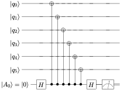

use `qasm2circ` to visualize quantum circuits

## Package used
`qasm2circ-v1.4`
Official site: https://www.media.mit.edu/quanta/qasm2circ/

My contribution: the original package can only build files and ouput in current folder, which turns the folder in to a fat pool and require cleaning once a while. I modify the code to enable building files in external folder, save intermedium files in cache folder, and export pdf to source folder. This give you a neat 

## how to use
```
cd qasm2circ-v1.4                           #cmd can only be called in this folder
./qasm2pdf ../zwl_sample/steane.qasm        #general cmd: ./qasm2pdf <path_to>/steane.qasm
#output: ../zwl_sample/steane.pdf
```
for python3 version
```
cd qasm2circ-v1.4-py3                           #cmd can only be called in this folder
./qasm2pdf ../zwl_sample/steane.qasm        #general cmd: ./qasm2pdf <path_to>/steane.qasm
#output: ../zwl_sample/steane.pdf
```
To save all intermediate files in a folder, one needs mannually create `cache` folder.

## Sample gates in qasm format

```
# Notes: qasm instructions are as follows.  Lines begining with '#'
# are comments.  All other lines should be of the form <b>op<b>args
# where <b> is whitespace, and op-args pairs are:
#
# qubit   name,initval
# cbit    name,initval
# measure qubit
# H       qubit
# X	  qubit
# Y	  qubit
# Z	  qubit
# S       qubit
# T       qubit
# nop	  qubit
# zero    qubit
# discard qubit
# slash   qubit
# dmeter  qubit
# cnot    ctrl,target
# c-z     ctrl,target
# c-x     ctrl,target
# toffoli ctrl1,ctrl2,target
# ZZ      b1,b2
# SS      b1,b2
# swap    b1,b2
# Utwo    b1,b2
# space   qubit
# def     opname,nctrl,texsym
# defbox  opname,nbits,nctrl,texsym
#
# Where:
#
# def     - define a custom controlled single-qubit operation, with
#           opname  = name of gate operation
#           nctrl   = number of control qubits
#           texsym  = latex symbol for the target qubit operation
# defbox  - define a custom muti-qubit-controlled multi-qubit operation, with
#           opname  = name of gate operation
#           nbits   = number of qubits it acts upon
#           nctrl   = number of control qubits
#           texsym  = latex symbol for the target qubit operation
# qubit   - define a qubit with a certain name (all qubits must be defined)
#           name    = name of the qubit, eg q0 or j2 etc
#           initval = initial value (optional), eg 0
# cbit    - define a cbit with a certain name (all cbits must be defined)
#           name    = name of the cbit, eg c0
#           initval = initial value (optional), eg 0
# H       - single qubit operator ("hadamard")
# X       - single qubit operator 
# Y       - single qubit operator 
# Z       - single qubit operator
# S       - single qubit operator
# T       - single qubit operator
# nop     - single qubit operator, just a wire
# space   - single qubit operator, just an empty space
# dmeter  - measure qubit, showing "D" style meter instead of rectangular box
# zero    - replaces qubit with |0> state
# discard - discard qubit (put "|" vertical bar on qubit wire)
# slash   - put slash on qubit wire
# measure - measurement of qubit, gives classical bit (double-wire) output
# cnot    - two-qubit CNOT
# c-z     - two-qubit controlled-Z gate
# c-x     - two-qubit controlled-X gate
# swap    - two-qubit swap operation 
# Utwo    - two-qubit operation U
# ZZ      - two-qubit controlled-Z gate, symmetric notation; two filled circles
# SS      - two-qubit gate, symmetric; open squares
# toffoli - three-qubit Toffoli gate
```


## Sample circuit

`zwl_sample/xx2.qasm`

```
# Weilei Zeng
# A circuit to measure XXX XXX in shor's code

  qubit	   q0
  qubit	   q1
  qubit	   q2
  qubit	   q3
  qubit	   q4
  qubit	   q5
  qubit	   A0,0

  H	   A0
  cnot	   A0,q0
  cnot	   A0,q1
  cnot	   A0,q2
  cnot	   A0,q3
  cnot	   A0,q4
  cnot	   A0,q5
  H	   A0
  measure  A0
  ```
  
  


## Roadmap
- [x] build files in external folder
